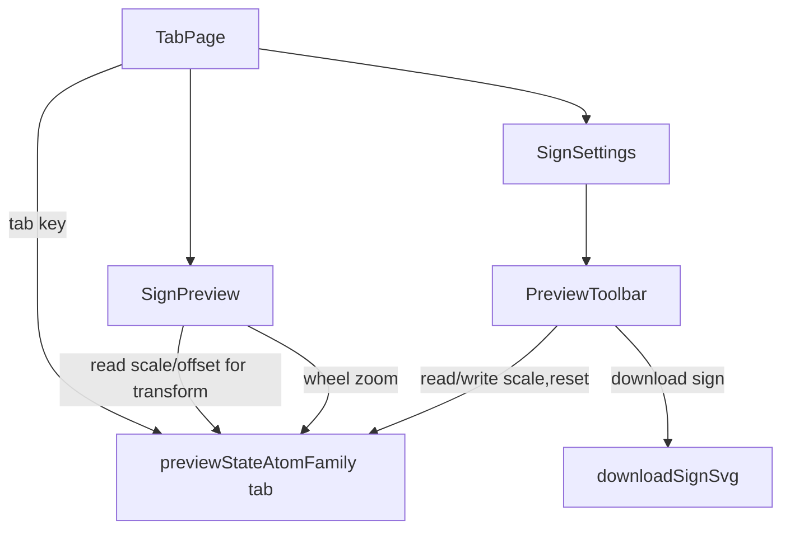

## 用户需求
将预览区的"下载、调整缩放"相关按钮（缩小、放大、百分比、复位、下载）整体从中间预览区顶部，移动到右侧设置栏的上方。

## 产品概述
在标志生成器界面中，原本位于中间预览画布顶部的工具栏（缩放控制与下载）改置于右侧设置栏顶部。预览画布与工具栏之间仍共享同一套缩放/平移状态，确保点击设置栏上的缩放按钮能实时影响中间画布显示。

## 核心功能
- 在右侧设置栏顶部新增工具栏：缩小、当前缩放百分比、放大、复位、下载 SVG 五个控件，样式与原有工具栏一致。
- 移除中间预览区顶部的原工具栏。
- 缩放（scale）与平移（offset）状态改用 jotai 管理，并按 tab 隔离，保证各标签页互不干扰。
- 中间画布实时读取 jotai 中的 scale/offset 应用 transform；滚轮缩放与拖拽平移继续生效。
- 下载功能保持原有行为（导出当前 SVG 文件）。


## 技术栈
- 框架：Next.js 16（App Router）+ React 19
- 状态管理：jotai（新增依赖）
- UI 组件：项目既有 `Button`、`lucide-react` 图标，Tailwind CSS
- 语言：TypeScript

## 实现方案
### 总体策略
引入 jotai，将 `scale`/`offset` 这两个预览视图状态从 `SignPreview` 本地 `useState` 提升为 jotai atom，并按当前 tab 做 key 隔离（使用 `atomFamily` 或基于 `Provider` scope）。新建独立工具栏组件 `PreviewToolbar`，渲染于右侧 `SignSettings` 的 `<aside>` 顶部，通过 jotai 读取/修改 `scale` 并触发 `reset`/`download`。`SignPreview` 仅保留画布渲染、滚轮缩放、`previewRef` 拖拽逻辑，缩放值改从 jotai 读取。

### 关键决策与权衡
1. **按 tab 隔离**：jotai 默认全局单例，而每个 `[tab]` 路由会渲染独立 `SignPreview`。采用 `atomFamily(tab => ({ scale: atom(1), offset: atom({x:0,y:0}) }))`，以 `tab` 为 key，避免跨页签状态串扰；`reset` 同时 `set` 两值。
2. **状态提升范围**：仅 `scale`/`offset` 入 jotai（`isDragging`、`showPosition`、`measurement` 等仍属画布本地 UI 状态，保持 `useState` 不变）。`download` 不依赖状态，提取为共享纯函数 `downloadSignSvg(sign)` 放入 jotai 模块或独立工具，工具栏直接调用。
3. **滚轮缩放**：`SignPreview` 内 `handleWheel` 继续调用 jotai 的 `zoom` action（从 atom 取值计算后写回），行为不变。
4. **依赖新增**：执行 `pnpm add jotai`，在 `Providers.tsx` 包裹 `<Provider>`（如需 scope 隔离可按 tab 嵌套 Provider；`atomFamily` 方案下全局 Provider 即可）。

### 性能与可靠性
- jotai 细粒度订阅，仅缩放相关组件重渲染；画布 transform 随 scale/offset 变化更新，无额外开销。
- `atomFamily` 按需创建 atom，规模极小（仅 3 个 tab），无内存压力。
- 下载仍基于 `document.querySelector('svg[role=img]')`，与现状一致，无需改动 DOM 结构。

## 实现要点
- 复用既有 `Button`（variant="ghost" size="icon" className="size-7"）与 `lucide-react` 的 `ZoomIn`/`ZoomOut`/`RotateCcw`/`Download` 图标，保持视觉一致。
- `MIN_SCALE=0.4` / `MAX_SCALE=3` 常量移至 jotai 模块复用。
- `SignPreview` 移除第 333-363 行工具栏 div，section 直接以画布承接。
- `SignSettings` 的 `<aside>` 顶部（第 332 行 `settingName` 之前）插入 `<PreviewToolbar sign={sign} />`，并接收 `sign` 以支持下载。

## 架构设计

组件间通过 jotai atom 解耦，工具栏与画布无需直接通信。

## 目录结构
```
src/
├── app/
│   ├── [tab]/
│   │   ├── SignPreview.tsx      # [MODIFY] 移除顶部工具栏；scale/offset 改读 jotai；保留画布、滚轮、拖拽
│   │   ├── SignSettings.tsx     # [MODIFY] 顶部 aside 插入 PreviewToolbar，传入 sign
│   │   ├── PreviewToolbar.tsx   # [NEW] 缩放/下载工具栏，读 jotai scale，调用 zoom/reset/download
│   │   └── TabPage.tsx          # [MODIFY] 向 PreviewToolbar 透传 sign（已传 SignSettings，复用即可）
│   ├── Providers.tsx            # [MODIFY] 引入 jotai Provider 包裹
│   └── state/
│       └── preview-store.ts     # [NEW] jotai atomFamily(scale/offset)、zoom/reset actions、downloadSignSvg、MIN/MAX_SCALE
└── package.json                 # [MODIFY] 新增 jotai 依赖
```

## 关键代码结构
```typescript
// src/app/state/preview-store.ts
import { atom } from 'jotai'
import type { Sign } from '@/lib/types'

export const MIN_SCALE = 0.4
export const MAX_SCALE = 3

export interface PreviewOffset { x: number; y: number }

export const previewStateAtomFamily = atom((_get, _set, tab: string) => ({
  scale: atom(1),
  offset: atom<PreviewOffset>({ x: 0, y: 0 }),
}))

export function downloadSignSvg(sign: Sign): void
```

